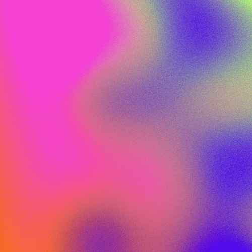
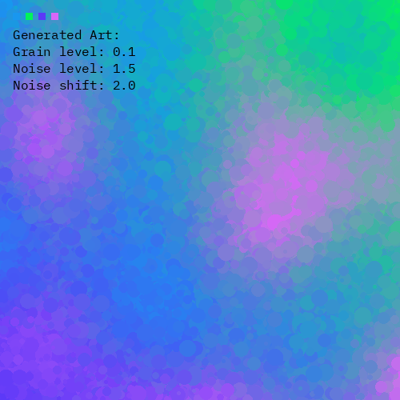
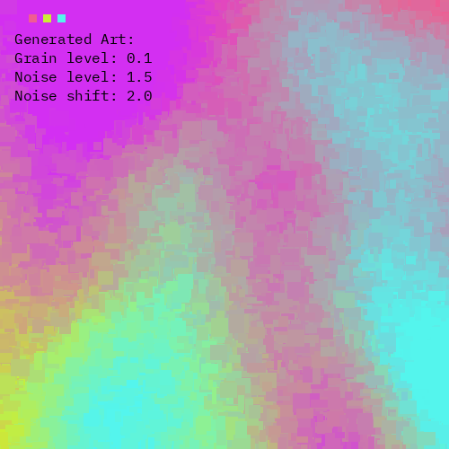
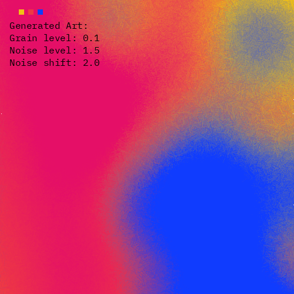

<h1 align="center">Ombre</h1>

Python script to randomly generate gradient artworks

## 📺 Demo

#### Default Output Image:

#### Output Image Drawn with Circles:

#### Output Image Drawn with Blocks:

#### Output Image Drawn with Lines:

## 🛠 Built With

- Python3
- Pillow
- Noise

## 🤝 Support

Give a ⭐️ if you like this project!
